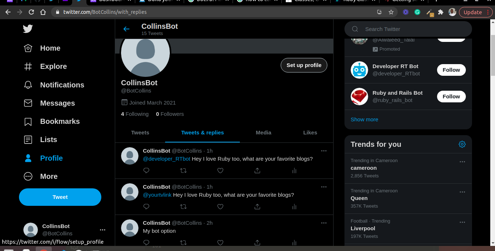

# RubyCapstoneBot-


# Ruby Capstone - Twitter Bot

This is a twitter bot, it tweet and retweet on twitter.
I made this bot cause I use twitter a lot, so it was only logical. Also the Twitter API is very well documented and made it easy to implement on the project.
It has been made using ruby with some classes to take the load from the main script. 
I corrected the errors using Rubocop and used RSpec to do the testing.

## Screenshot



## Built With

- Ruby
- Rubocop
- RSpec
- Linter

## Getting Started

First ensure that you have ruby installed on your local machine.

To get a local copy up and running follow these simple example steps.

## Prequisites

Ruby installed on your local machine.
Terminal or similar to execute the program.

### Twitter API

You need to sign up to the developer program in Twitter to get access to their API keys. 
After that, open the api.rb file in the lib folder and edit it so that it contains the following: 

```
config.consumer_key = 'API-Key'
config.consumer_secret = 'API-Key secret'
config.access_token = 'Access Token'
config.access_token_secret = 'Access Token Secret'

```

### Gem libraries used
- twitter
- open-uri

To install those libraries, simply use terminal like so ```sudo gem install [library name]```

## Install

Download a copy of the repository

## Usage

In terminal, cd to the folder ```cd RubyCapstoneBot```
Execute in terminal like so ```ruby bin/bot.rb```

## Testing
In this project the testing was done using RSpec to test all game logic methods.

### Install
- In a terminal window type gem install rspec
- Once rspec install has finished, type rspec --init
- You will see a folder spec and a file .rspec
- Inside spec folder you'll see a spec_helper.rb file.

### Run
I have already created test_spec.rb file.
- go to the folder inside your terminal type rspec test_spec.rb
- If all test pass you will see:
 `1 examples, 0 failures`


## Authors

👤 **Makungong Collins Tatang**

- GitHub: [@CollinsTatang](https://github.com/CollinsTatang)
- Twitter: [@CollinsTatang1](https://twitter.com/CollinsTatang1)
- LinkedIn: [makungong-collins](https://www.linkedin.com/in/makungong-collins-b43260190/)

## 🤝 Contributing

Contributions, issues, and feature requests are welcome!

Feel free to check the [issues page](https://github.com/CollinsTatang/RubyCapstoneBot/issues).

## Show your support

Give a ⭐️ if you like this project!

## 📝 License

This project is [MIT](LICENSE) licensed.
